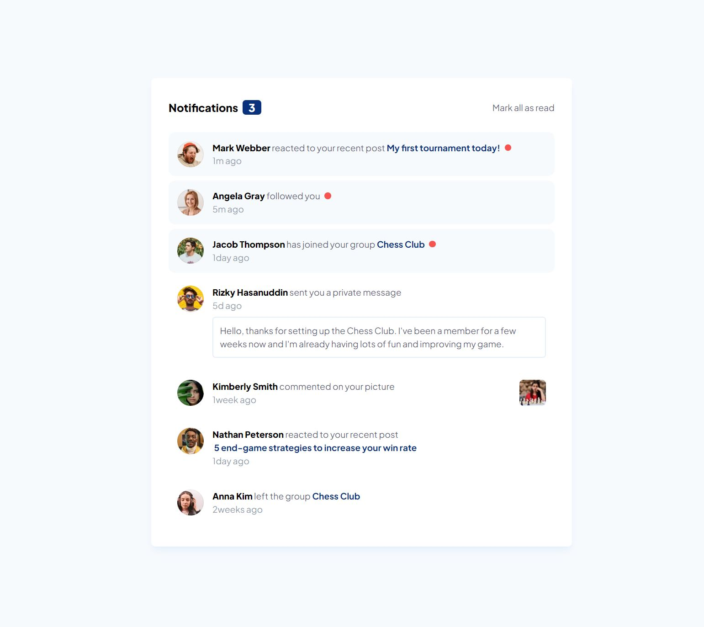
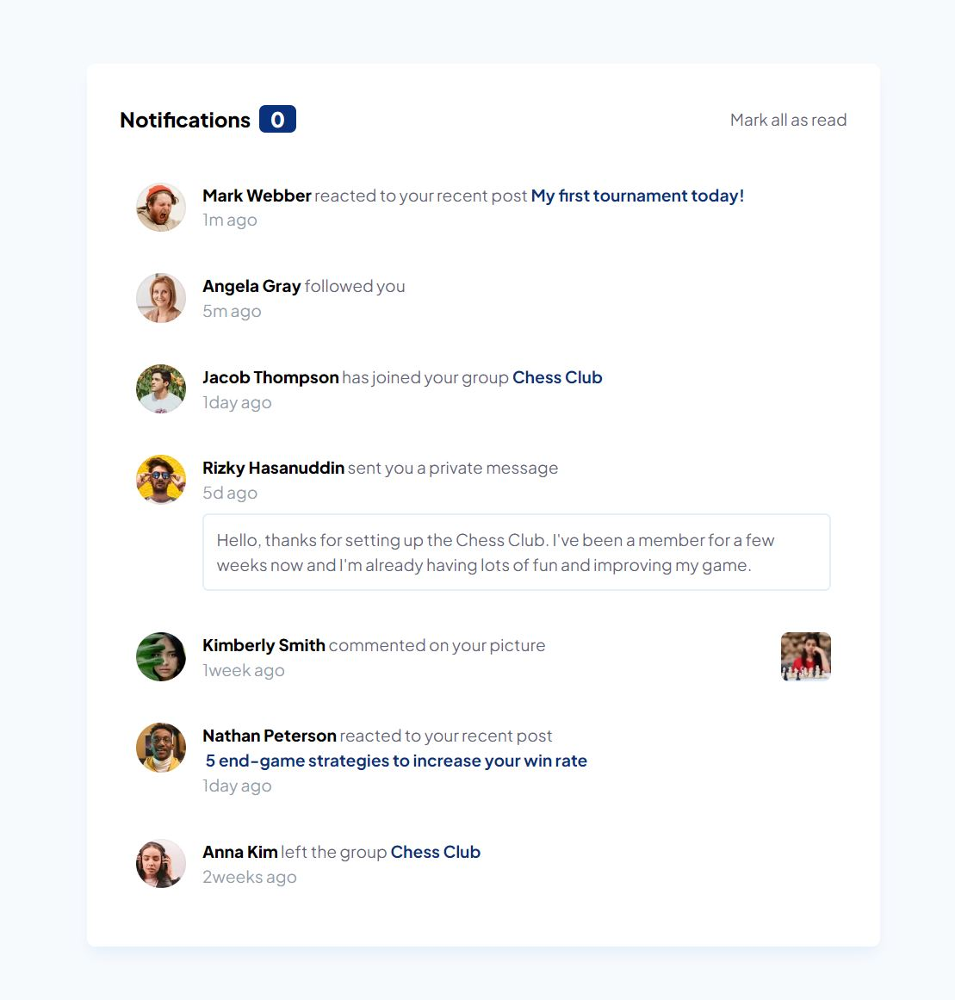
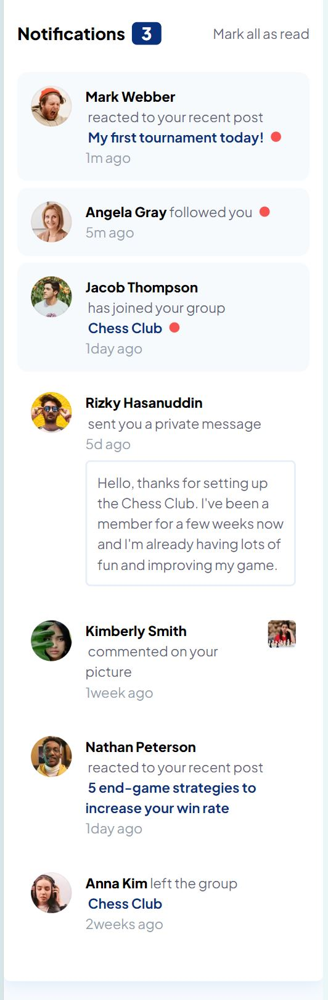

# Frontend Mentor - Notifications page solution

This is a solution to the [Notifications page challenge on Frontend Mentor](https://www.frontendmentor.io/challenges/notifications-page-DqK5QAmKbC). Frontend Mentor challenges help you improve your coding skills by building realistic projects.

## Table of contents

- [Overview](#overview)
  - [The challenge](#the-challenge)
  - [Screenshot](#screenshot)
  - [Links](#links)
- [My process](#my-process)
  - [Built with](#built-with)
  - [What I learned](#what-i-learned)
  - [Useful resources](#useful-resources)
- [Author](#author)

## Overview

### The challenge

Users should be able to:

- Distinguish between "unread" and "read" notifications
- Select "Mark all as read" to toggle the visual state of the unread notifications and set the number of unread messages to zero
- View the optimal layout for the interface depending on their device's screen size
- See hover and focus states for all interactive elements on the page

### Screenshot

### Links

- [Solution URL](https://github.com/Nospiel-code/fm-notification-page)
- [Live Site URL](https://your-live-site-url.com)

## My process

### Built with

- Mobile-first workflow
- [React](https://reactjs.org/)
- [Vite.js](https://nextjs.org/)
- [Tailwind CSS](https://tailwindcss.com/)

### What I learned

This is the first React project I built, so I started very basic and just used the useState Hook.
In the following weeks I want to build more projects on Frontend Mentor using React.

### Useful resources

- [The Ultimate React Course 2024](https://www.udemy.com/course/the-ultimate-react-course/?couponCode=ST9MT71624) - A course on React that I started a few months ago

## Author

- Frontend Mentor - [@Nospiel-code](https://www.frontendmentor.io/profile/Nospiel-code)
- Twitter - [@tomsdev4](https://www.twitter.com/tomsdev4)
